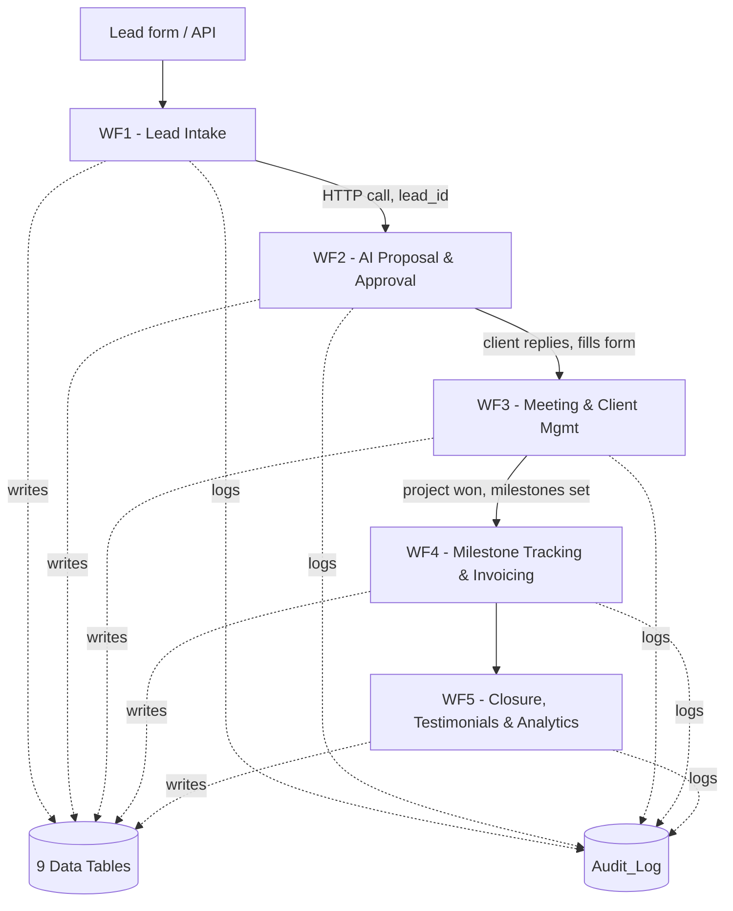

# AI Freelancing Business Automation Platform

**Summer School'26 — N8N Capstone Project**
Domain: Freelancing & Professional Services

---

## Overview

Freelancers run every part of their business alone — finding leads, writing proposals, scheduling calls, tracking milestones, invoicing, chasing payments, and following up after a project ends — without the sales, admin, or accounting teams a normal business has. This project automates that entire lifecycle using **5 interconnected n8n workflows**.

## Problem Statement

Freelancers spend significant time on non-billable admin work: searching for projects, responding to inquiries, writing proposals, scheduling meetings, tracking milestones, generating invoices, following up on payments, and managing completed projects. This platform automates those steps end-to-end, with AI assistance and a human approval gate where it matters.

## Business Context & Pain Points

- Writing personalized proposals for every lead is slow and inconsistent.
- Leads, meetings, milestones, and invoices scattered across tools lead to dropped follow-ups.
- Chasing overdue payments is uncomfortable and easy to forget.
- Testimonials and portfolio upkeep are rarely prioritized despite their long-term value.
- No single view of business performance (revenue, conversion rate, throughput).

## Objectives

1. Automate client and project management.
2. Generate AI-powered, personalized proposals — with human approval before anything reaches a client.
3. Track project progress and milestones automatically.
4. Simplify invoicing and payment follow-ups.
5. Maintain business insights across growth, earnings, and client satisfaction.

## Architecture




The platform is 5 independent workflows sharing a common data layer of 9 n8n Data Tables. Workflows hand off to each other via direct HTTP calls or by writing to shared tables that a later, schedule-triggered workflow reads. Every workflow writes to a shared `Audit_Log` on each meaningful event.

## Workflow Overview

| Workflow | Trigger | Purpose |
|---|---|---|
| **WF1 — Lead Intake & Discovery** | Webhook | Captures incoming leads, deduplicates by email + project title |
| **WF2 — AI Proposal Generation & Approval** | Webhook (x2) | Gemini drafts a personalized proposal; human approves/rejects via email before it reaches the client |
| **WF3 — Meeting Scheduling & Client Management** | Form | Schedules client meetings, deduplicates client records |
| **WF4 — Milestone Tracking & Invoicing** | Schedule (daily) | Auto-generates invoices on milestone completion, sends escalating overdue-payment reminders |
| **WF5 — Project Closure, Testimonials & Analytics** | Schedule (weekly) | Detects finished projects, requests testimonials, computes business analytics |

Full node-by-node documentation for each workflow is in [`docs/workflow-documentation.md`](docs/workflow-documentation.md).

## AI Functionality

WF2 uses **Google Gemini** to draft a personalized proposal from the lead's name, project details, budget, and deadline. The AI draft never goes straight to a client — it sits behind a human approval gate (an email with Approve/Reject links) before it can be sent.

## Advanced Features Demonstrated

| Feature | Where |
|---|---|
| AI-powered decision making | WF2 (Gemini proposal generation) |
| Human approval | WF2 (email-based approve/reject gate) |
| Error handling / retries | Retry On Fail enabled on external API nodes across WF2–WF5 |
| Logging / audit trail | Shared `Audit_Log` table, written to by all 5 workflows |
| Scheduled workflows | WF4 (daily), WF5 (weekly) |
| Webhook-triggered workflows | WF1, WF2 (x2), WF3 (form) |
| Conditional branching | Dedupe checks (WF1, WF3), approval decision (WF2), milestone completeness (WF5) |
| Loops | Per-milestone invoicing, per-invoice reminders (WF4), per-project checks (WF5) |

## Technologies & Integrations

- **n8n** (Community Edition, v2.31.5), self-hosted via Docker
- **Google Gemini** — AI proposal generation
- **Gmail** — approval emails, client communication, meeting confirmations, payment reminders
- **n8n Data Tables** — shared data layer (9 tables: Leads, Clients, Proposals, Meetings, Projects, Milestones, Invoices, Testimonials, Audit_Log)

## Data Management

All business data lives in n8n's built-in Data Tables. See [`docs/workflow-documentation.md`](docs/workflow-documentation.md) for the full schema. Lead deduplication uses a hash of lowercased email + project title; client deduplication uses n8n's native "If Row Exists" pattern.

## Setup Instructions

1. Install n8n Community Edition (v2.31.5) via Docker.
2. Import each workflow JSON from [`workflows/`](workflows/) into n8n.
3. Create the 9 Data Tables listed in the data model section of [`docs/workflow-documentation.md`](docs/workflow-documentation.md).
4. Add credentials: Google Gemini API key, Gmail OAuth.
5. Activate all 5 workflows.

## How to Run / Test

- Trigger WF1 by POSTing a test lead to its webhook.
- Trigger WF2 by calling `/generate-proposal` with a `lead_id`.
- Trigger WF3 by submitting the "Schedule a Meeting" form.
- WF4 and WF5 run automatically on their schedules, or can be executed manually from the n8n canvas for testing.

Test cases and results for every workflow are documented in [`docs/testing.md`](docs/testing.md).

## Screenshots

See [`screenshots/`](screenshots/) for workflow canvases and execution evidence.

## Demo Video

[Link to demo video] — 5–10 minute walkthrough of the end-to-end business flow.

## Project Structure

```
freelance-automation-capstone/
├── README.md
├── workflows/
│   ├── WF1 - Lead Intake & Discovery.json
│   ├── WF2 - AI Proposal Generation & Approval.json
│   ├── WF3 - Meeting Scheduling & Client Management.json
│   ├── WF4 - Milestone Tracking & Invoicing.json
│   └── WF5 - Project Closure, Testimonials & Analytics.json
├── docs/
│   ├── project-documentation.md
│   ├── workflow-documentation.md
│   └── testing.md
├── diagrams/
│   └── architecture.png
├── screenshots/
└── presentation/
```

## Known Limitations

- Approval links rely on `localhost`, so they only work when opened on the same machine running n8n.
- Meeting scheduling is manually initiated via form rather than parsing real client email replies.
- Marking a project "won" and marking invoices "paid" are currently manual data-table edits rather than automated steps.

## Future Improvements

- Portfolio curation and client-satisfaction scoring are natural extensions of the existing Testimonials and Projects tables, and were scoped out to keep the 5-workflow architecture focused for this submission.
- Automate the "won" and "paid" state transitions currently handled as manual data-table edits.
- Replace the localhost-dependent approval links with a public tunnel for cross-device testing.

## Author

Mridu Verma — Summer School'26 N8N Capstone
